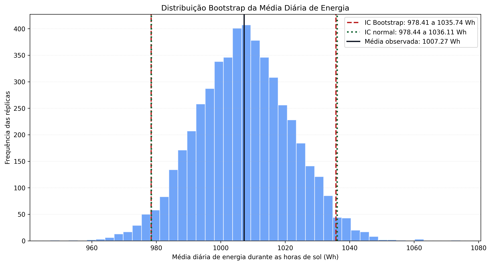
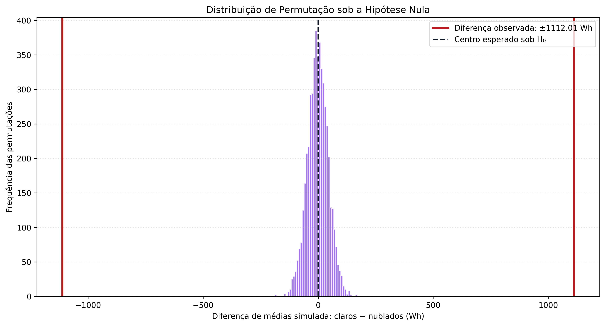
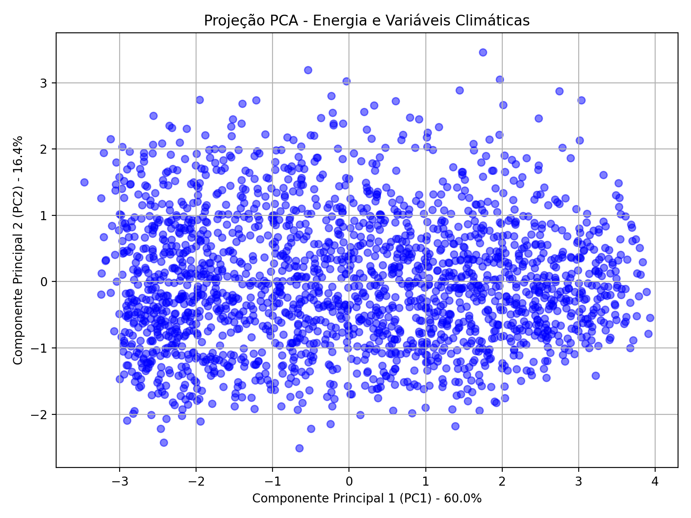
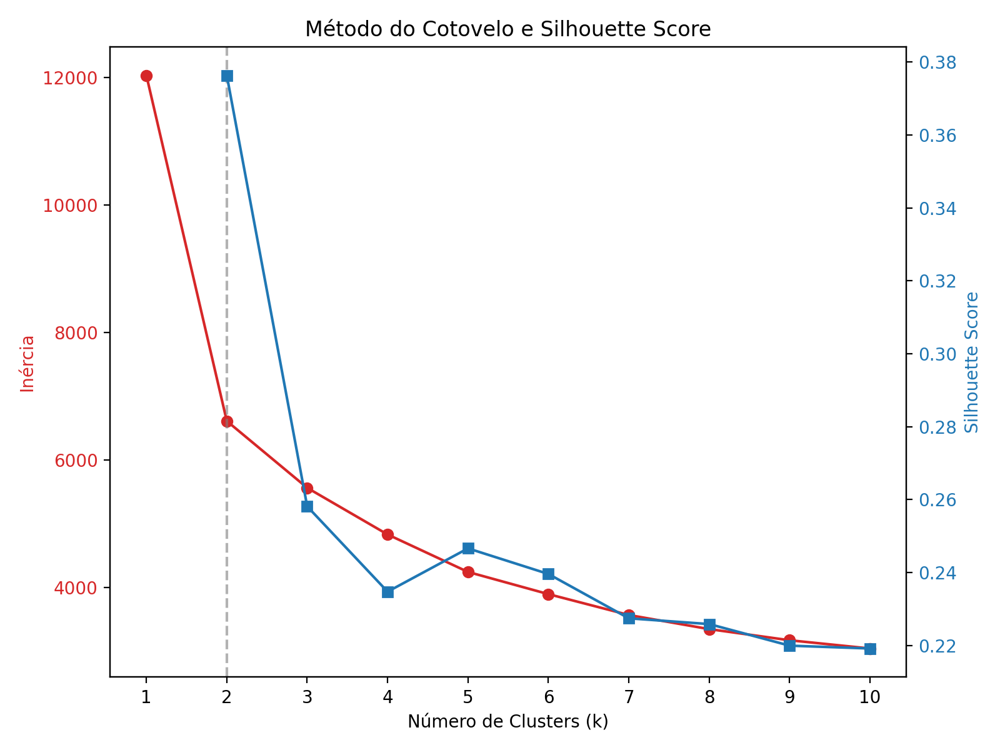
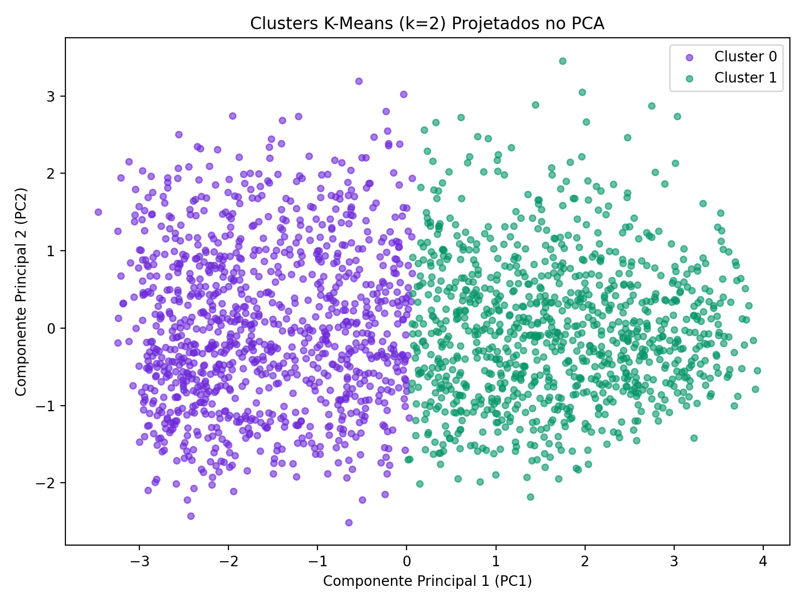

# Energia, clima e recursos renováveis — AVP1 + AVP2

Projeto acadêmico de Ciência de Dados — IFCE, Campus Tauá, tema F.

| Integrante | Responsabilidade |
|---|---|
| Guilherme Alves dos Santos | Base comum, Bootstrap, teste A/B, integração e reprodutibilidade |
| Guilherme Monteiro | Regressão múltipla e comparação Logística × KNN |
| Paulo Cosmo | PCA, K-Means, perfis e discussão causal/operacional |

## 1. Executar e conferir

Ambiente de referência: **Python 3.12**. Versões principais fixadas em
`requirements.txt`. No Windows/PowerShell, na pasta do projeto:

```powershell
py -3.12 -m venv .venv
.\.venv\Scripts\python.exe -m pip install -r requirements.txt
.\.venv\Scripts\python.exe main.py
.\.venv\Scripts\python.exe -m unittest discover -s tests -v
.\.venv\Scripts\python.exe verificar_entrega.py
```

No Linux/macOS, crie o ambiente com `python3.12 -m venv .venv` e use
`.venv/bin/python` nos demais comandos. Não é necessário ativar o ambiente.
O bruto **já está versionado** em `dados_brutos/Renewable.csv`.
`main.py` reconstrói o CSV limpo; não é preciso baixar outro dataset.

A execução realiza ingestão, limpeza, EDA, agregação diária, inferência,
regressão, classificação, PCA/K-Means e exportação de métricas. Todos os
módulos são obrigatórios: uma dependência ausente interrompe a execução.

As cinco figuras exigidas são salvas **na raiz**, mesmo ao executar o script
a partir de outra pasta:

| Arquivo | Conteúdo |
|---|---|
| `distribuicao_bootstrap.png` | Médias reamostradas e dois ICs de 95% |
| `distribuicao_permutacao.png` | Distribuição nula e diferença observada |
| `pca_projecao.png` | Duas componentes principais |
| `curva_cotovelo_kmeans.png` | Inércia e silhouette por k |
| `clusters_kmeans.png` | Clusters projetados no PCA |

Também são gerados `dados_limpos_final.csv`, `resultados_avp2.json` (métricas,
versões, hash do bruto e contagens) e três gráficos exploratórios em `outputs/`.
Cópias antigas dos gráficos exploratórios na raiz não são a saída atual.
O verificador confere artefatos e consistência; não substitui a avaliação
científica ou a conferência das regras de submissão do professor.

## 2. Dados, amostragem e tratamento — AVP1

A documentação original identifica a fonte como o dataset Kaggle
*Renewable Power Generation and Weather Conditions*. O arquivo utilizado é
exatamente o CSV versionado, cujo SHA-256 é registrado a cada execução.
A localização, a quantidade de instalações e as unidades físicas de GHI/vento
não foram confirmadas por um dicionário de dados. Não presumimos cobertura
geográfica representativa nem convertemos essas unidades sem fonte.

A população de interesse são sistemas de geração solar; a estrutura de acesso
é a série disponível de 2017–2022, não uma amostra probabilística de todas as
usinas. Seleção dos locais, clima e período limitam generalizações.

O bruto tem **196.776 linhas e 17 colunas**; a limpeza canônica produz
**186.625 linhas e 17 colunas**. O ETL normaliza textos, imputa números pela
mediana de cada hora (com mediana global como alternativa) e filtra extremos
sequencialmente por IQR em energia, GHI, temperatura, pressão, umidade e vento.
Os quartis são calculados sobre valores positivos da variável; zeros são
preservados. Isso não equivale a identificar dia/noite para toda variável física.

A imputação pode reduzir artificialmente a dispersão e alterar relações.
O IQR pode remover extremos legítimos, inclusive temperaturas negativas.
A base final descreve os registros retidos: somas mensais após o filtro não
são totais brutos auditados. A EDA mostra ciclo horário, evolução mensal e
associação GHI × energia. Dispersão não comprova causalidade.

## 3. Unidade analítica comum

`src/analysis_utils.py` seleciona `isSun == 1` e agrega por data. São
**2.005 dias**, de **01/01/2017 a 31/08/2022**. Todos os módulos usam essa base.
`energia_media` é a média de `Energy delta[Wh]` dos intervalos solares retidos
de cada dia: **Wh por intervalo observado, não energia total diária nem potência**.
Cada dia recebe peso igual, mesmo com quantidades diferentes de observações.

GHI, temperatura, umidade, nuvens e vento também são médias dos intervalos
solares. Chuva, neve e contagem de observações ficam disponíveis, mas chuva
e neve não entram nos preditores supervisionados nem no PCA.
A agregação reduz pseudorreplicação de medições vizinhas, mas não elimina
autocorrelação, sazonalidade ou viés de dias incompletos.

## 4. Bootstrap, IC e Teorema Central do Limite

São **5.000 réplicas**, com reposição, tamanho N e `random_state=42`.
O IC percentil usa os quantis 2,5% e 97,5% das médias reamostradas.
O IC normal é `média ± 1,96 × s / sqrt(N)`, com desvio amostral (`ddof=1`).

| Estatística | Valor |
|---|---:|
| N | 2.005 dias |
| Média | 1.007,27 Wh |
| Desvio padrão amostral | 658,75 Wh |
| Erro padrão | 14,71 Wh |
| Assimetria | 0,124 |
| IC 95% Bootstrap | [978,41; 1.035,74] Wh |
| IC 95% normal | [978,44; 1.036,11] Wh |

N grande e assimetria pequena favorecem a aproximação normal da distribuição
da média; os ICs quase coincidem. Entretanto, o TCL exige condições de
independência ou dependência suficientemente fraca, não verificadas pela simples
agregação. Os ICs são aproximações exploratórias sob reamostragem de dias
independentes. Bootstrap em blocos seria uma extensão para dependência temporal.
Coincidência dos ICs não demonstra independência. IC 95% refere-se à cobertura
do procedimento em amostragens repetidas, não a conter 95% das energias diárias.



## 5. Teste A/B observacional por permutação

Grupo A: `nuvens_media <= 30`; grupo B: `nuvens_media >= 70`.
Sem sobreposição; **607 dias intermediários** excluídos.
H₀: μA = μB; H₁: μA ≠ μB; bicaudal; **α = 0,05**.

| Medida | Claros (A) | Nublados (B) |
|---|---:|---:|
| Dias | 276 | 1.122 |
| Média | 1.751,20 Wh | 639,19 Wh |

A diferença A−B é **1.112,01 Wh**. Em **5.000 permutações**, embaralhamos
rótulos preservando tamanhos dos grupos. Com semente 42, nenhuma diferença
simulada foi tão extrema em módulo quanto a observada. A correção de Monte
Carlo dá `p = (0 + 1)/(5000 + 1) = 0,000200`, não zero. Rejeitamos H₀ sob as
hipóteses do procedimento.

A validade exata da permutação exige intercambiabilidade dos rótulos sob a
nula, condição mais forte que apenas igualdade de médias. Grupos naturais,
heterogeneidade e dependência temporal limitam a interpretação. Não houve
randomização: é um contraste **observacional**, não experimento causal.
A diferença apoia planejamento conservador em dias nublados, mas não estima
o efeito isolado de alterar a nebulosidade.



## 6. Regressão linear múltipla

Y = `energia_media`; X = GHI, temperatura, umidade, nuvens e vento médios.
Treino: **1.778 dias de 2017–2021**; teste: **227 dias de 2022**.
`LinearRegression` inclui intercepto.

| Termo | Estimativa |
|---|---:|
| Intercepto | 940,4537 |
| GHI | 15,6710 |
| Temperatura | −16,2446 |
| Umidade | −3,6616 |
| Nuvens | −4,3524 |
| Vento | −10,7422 |

Mantendo os outros X constantes (*ceteris paribus*), uma unidade de GHI
associa-se a +15,67 Wh na resposta; uma unidade de temperatura a −16,24 Wh;
um ponto percentual de umidade a −3,66 Wh; um ponto percentual de nuvens a
−4,35 Wh; uma unidade original de vento a −10,74 Wh. São associações
condicionais, não efeitos causais. O intercepto é a previsão com todos os X
iguais a zero, cenário possivelmente fora do domínio observado.

No teste: **R² = 0,7082; RMSE = 328,17 Wh**. R² resume a redução do erro
quadrático frente à média do próprio teste, não porcentagem de previsões
corretas. O RMSE tem a unidade do alvo. Preditores correlacionados e fatores
omitidos limitam a interpretação dos coeficientes.

## 7. Classificação: Logística × KNN

`alta_geracao = 1` quando a energia supera a mediana **apenas do treino**;
caso contrário, classe 0. O limiar é **990,8153 Wh** (precisão completa no JSON).
Usam-se os mesmos cinco X e o mesmo teste de 2022 da regressão.

Os dois modelos têm `StandardScaler` dentro de `Pipeline`: a escala é
ajustada apenas na parcela de treino de cada dobra. `GridSearchCV` maximiza
F1 em cinco dobras de `StratifiedKFold(shuffle=True, random_state=42)` no treino.

- Logística: C ∈ {0,1; 1; 10}; class_weight ∈ {None, balanced}; max_iter=2000.
- KNN: vizinhos ∈ {3, 5, 7, 11, 15}; weights ∈ {uniform, distance}; p ∈ {1, 2}.

Melhores: **Logística C=10, class_weight=None**;
**KNN n_neighbors=15, weights=uniform, p=1 (Manhattan)**.

| Métrica no teste | Logística | KNN |
|---|---:|---:|
| Acurácia | 93,83% | 90,75% |
| Precisão (classe 1) | 92,76% | 89,68% |
| Recall (classe 1) | 97,92% | 96,53% |
| F1 (classe 1) | 95,27% | 92,98% |
| Matriz: [[TN, FP], [FN, TP]] | [[72, 11], [3, 141]] | [[67, 16], [5, 139]] |

Linhas são classes reais; colunas, previstas; ordem [0, 1]. O teste contém
83 dias de classe 0 e 144 de classe 1. A Logística foi superior nas quatro
métricas desta avaliação, sem garantia de superioridade em novos anos/locais.
Falsos positivos podem superestimar energia disponível; falsos negativos
podem tornar o planejamento excessivamente conservador.

### Limites da avaliação supervisionada

O teste não ajusta modelos, escala, hiperparâmetros ou mediana do alvo.
**Isso não elimina todo vazamento**: o ETL da AVP1 calcula medianas e limites
IQR na série completa antes da divisão, inclusive com informações de 2022,
e filtra o alvo. As dobras internas também misturam datas de 2017–2021.
As métricas são exploratórias na base tratada, não validação temporal
rigorosamente isolada. Para produção, ajustar o ETL só no passado, preservar
o teste e usar validação temporal em janelas.

Os preditores meteorológicos são observados no próprio dia. Prever amanhã
exigiria previsões meteorológicas disponíveis antes da decisão e nova
avaliação incluindo seus erros; esse cenário não foi testado.

## 8. PCA e fundamentação por SVD

Padronizamos seis colunas: energia, GHI, temperatura, umidade, nuvens e vento,
evitando domínio das variáveis de maior escala. PCA/K-Means usam todos os
2.005 dias nesta análise descritiva, sem alegação de desempenho preditivo.

Para Z padronizada e centrada, a SVD escreve `Z = U Σ Vᵀ`. As direções
principais são vetores de V; escores são `Z V = U Σ`; variâncias são
proporcionais aos quadrados dos valores singulares. As duas primeiras
componentes retêm a maior variância entre projeções lineares ortogonais 2D.
O código usa `PCA(n_components=2, svd_solver='full')`.

**PC1 = 59,99%; PC2 = 16,37%; acumulada = 76,36%.** Cerca de 23,64% fica fora
da projeção: proximidade em 2D não garante identidade no espaço original.



## 9. K-Means, cotovelo e perfis

O K-Means minimiza distâncias quadráticas aos centroides nas **seis dimensões
padronizadas**, não só no PCA. Usa semente 42 e `n_init=20`. Inércia para
k=1…10; silhouette para k=2…10 (não definida para um único grupo).

| k | Inércia aproximada | Silhouette |
|---|---:|---:|
| 1 | 12.030,00 | não aplicável |
| 2 | 6.607,36 | 0,3764 |
| 3 | 5.559,21 | 0,2582 |
| 4 | 4.827,61 | 0,2348 |
| 5 | 4.239,79 | 0,2466 |
| 6 | 3.891,86 | 0,2396 |
| 7 | 3.564,53 | 0,2275 |
| 8 | 3.343,05 | 0,2259 |
| 9 | 3.168,26 | 0,2200 |
| 10 | 3.039,16 | 0,2192 |

Escolhemos **k=2**: a inércia cai 45,08% de 1 para 2, contra 15,86% de 2
para 3, com ganhos menores depois. Dois regimes privilegiam parcimônia e
coincidem com a maior silhouette. A curva não demonstra um cotovelo único
indiscutível; k=3 ou 4 daria perfis mais detalhados. A escolha documentada pela
inspeção da curva e apoiada por silhouette fica explícita no código.
Silhouette 0,3764 indica separação moderada, não perfeita.



| Cluster | Energia (Wh) | GHI¹ | Temperatura¹ | Umidade (%) | Nuvens (%) | Vento¹ |
|---|---:|---:|---:|---:|---:|---:|
| 0 | 492,75 | 27,24 | 6,68 | 85,05 | 85,53 | 4,57 |
| 1 | 1.551,91 | 85,51 | 15,46 | 66,64 | 48,99 | 3,66 |

¹ Unidades originais das colunas, sem conversão; GHI e vento não têm unidade
confirmada. Perfis são centroides na escala original. Cluster 0: menor
radiação/energia e mais umidade/nuvens; cluster 1: maior radiação/energia e
menos umidade/nuvens. Os rótulos 0 e 1 são arbitrários.



## 10. Correlação, causalidade e decisão operacional

Correlação é co-variação; previsão estima uma resposta usando entradas;
causalidade descreve efeito de intervenção. O mecanismo físico solar não
torna estes coeficientes observacionais provas causais.

Estação do ano e geometria solar afetam radiação, duração do dia e geração;
temperatura e condições dos painéis alteram rendimento. Sujidade, manutenção
e equipamentos são fatores omitidos plausíveis, não confundidores comprovados
só por serem plausíveis. GHI pode mediar a relação nuvens → energia;
ajustar um mediador muda a pergunta causal. Um experimento controlaria painéis,
temperatura e limpeza e variaria a exposição com randomização e segurança.

Propomos avaliar janelas de manutenção **eletiva** de menor geração esperada,
combinando previsões meteorológicas externas, perfis históricos e estimativas
supervisionadas após validação prospectiva. O cluster inclui energia observada:
não é possível atribuir o cluster de amanhã usando energia futura desconhecida.
Os perfis descrevem regimes passados; não são previsões prontas.

Não inferimos chuva só por nuvens: chuva não entrou no agrupamento. Segurança,
disponibilidade técnica e reparos urgentes prevalecem. Diferenças entre energia
observada e esperada podem motivar inspeção, mas não diagnosticam sozinhas
sujeira ou falha. Redução efetiva de perdas exigiria acompanhamento prospectivo,
não realizado nesta entrega.

## 11. Organização e entrega

- `main.py`: execução integrada; `src/relatorio.py`: exportação de métricas.
- `src/extract/`, `src/transform/`, `src/visualize.py`: AVP1.
- `src/analysis_utils.py`: base diária; `src/inference/`: Bootstrap e permutação.
- `src/models/`: regressão, classificação e não supervisionado.
- `docs/`: textos das contribuições; `tests/`: testes automatizados.
- `verificar_entrega.py`: conferência de artefatos e resultados.

Antes de entregar: rodar pipeline, testes e verificador; conferir cinco PNGs,
README e métricas na branch `main` do GitHub; enviar o link e demais arquivos
exigidos na plataforma da disciplina até **01/09/2026**. Atualizar o GitHub
não efetua automaticamente a submissão acadêmica.

Valores correspondem à base canônica no ambiente de referência. Dependências
transitivas/plataforma podem produzir pequenas diferenças numéricas; versões
principais são registradas no JSON. As limitações integram a análise; não se
alega validação de produção. Finalidade acadêmica não implica autorização
automática de redistribuição do dataset nem uma licença não informada.
